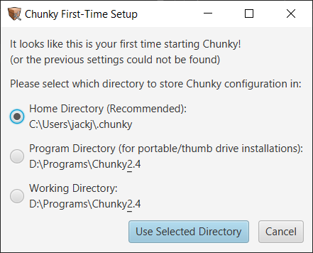

# Installing Chunky

There are two ways to install Chunky. You may download the installer for your OS[^1],
or you may download the Universal JAR (Chunky Launcher).

## Downloads

<!-- soon
<a href="https://chunky.llbit.se/download.html" class="md-button">:material-microsoft-windows: Windows <btnsub>Installer (beta)</btnsub></a>
<a href="https://chunky.llbit.se/download.html" class="md-button">:material-linux: Linux <btnsub>Debian package (beta)</btnsub></a>
<a href="https://chunky.llbit.se/download.html" class="md-button">:material-apple: macOS <btnsub>DMG image (beta)</btnsub></a>
-->
<a href="https://chunkyupdate.lemaik.de/ChunkyLauncher.jar" class="md-button">:material-package-variant-closed: Universal JAR  <btnsub>Chunky Launcher v1.13.1</btnsub></a>

---

### Universal JAR - Chunky Launcher - Setup

Chunky requires at least 512MB of free RAM and 23MiB of free storage[^5].

 1. You must install [**Java 17**](https://adoptium.net/) for your platform[^4].

 2. Download [**OpenJFX 18 x64 SDK**](https://gluonhq.com/products/javafx/) for your platform[^4][^6].

 3. [Download the Universal JAR / Chunky Launcher (ChunkyLauncher.jar)](http://chunkyupdate.lemaik.de/ChunkyLauncher.jar) and keep it
    in a safe place (you will use this to start Chunky).

---

#### Windows

 4. Extract from the OpenJFX .zip the `bin`, `legal`, and `lib` folders to `C:\Program Files\openjfx` or `..\.chunky\openjfx`, creating these folders if necessary.
 
 5. Launch ChunkyLauncher.jar. You may need to launch via command line/script using `java -jar "path\to\ChunkyLauncher.jar" --launcher`.

  

	<iframe src="https://www.youtube.com/embed/GTUhZVjatPY"></iframe>
  

---

#### Linux

 4. Extract from the OpenJFX .zip the `bin`, `legal`, and `lib` folders to `/javafx-sdk-17.0.1/`, creating these folders if necessary.

 5. Launch ChunkyLauncher.jar. `java --module-path javafx-sdk-17.0.1/lib --add-modules javafx.controls,javafx.fxml -jar launcher/ChunkyLauncher.jar`

---

#### macOS

Notes - On M1 equipped macs, which are aarch64 (ARM based), Rosetta 2 enables an emulation, of sorts, of x64 macOS 
applications. Please ensure both JDK and OpenJFX have matching architectures. We recommended native aarch64 however x64 performance should be similar. Furthermore, there are many other issues and bugs that are difficult to resolve. Please ask for assistance and we will try our best.

4. Open the `Terminal` and run the following commands (while fixing the .zip name):
	
	mkdir ~/.chunky
	unzip ~/Downloads/openjfx-17.0.1_osx-aarch64_bin-sdk.zip -d ~/.chunky/javafx

 5. Launch ChunkyLauncher.jar. `java -jar ChunkyLauncher.jar` (might be 
`java -jar ~/Downloads/ChunkyLauncher.jar`)

---

## Chunky First-Time Setup

The first time you start Chunky, you will be asked to pick a settings directory for Chunky:

The recommended directory is usually the best option. Click "Use Selected Directory" to continue.

Next, you will see the Chunky Launcher:

If you downloaded the Universal JAR (only Chunky Launcher) then you will have to update Chunky, otherwise can click "Launch" to start Chunky.

### Updating Chunky

In the launcher, hitting the "Check for Update" button will make the launcher check for an update to Chunky online.
This must be done the first time you start Chunky if you only downloaded the launcher.

If an update to Chunky is available you will soon see the "Update Available!" window:

Click the "Update to New Version" button to start downloading the required files.
When the download process has completed you can either click on "Launch Chunky" or "Close". If you click on "Close" you would need to click on "Launch" in the main Chunky Launcher window to launch Chunky.

---

## Snapshot builds

By default, the launcher will download _stable_ releases of Chunky. If you want to get the latest features and bug fixes (and maybe some new bugs or incomplete features), you can switch the "Release channel" under the "Advanced Settings" panel. The next time you check for updates, the launcher will download the latest Chunky snapshot.

The snapshots are automatically built every day from the [chunky-2.4.x](https://github.com/chunky-dev/chunky/tree/chunky-2.4.x) and [master](https://github.com/chunky-dev/chunky/commits/master) branches. Some plugins may not work with Chunky snapshots while some plugins may even require a certain snapshot (or later versions).

---

## Troubleshooting

If the launcher does not download the latest version or new snapshots, check the "Update Site" in the "Advanced Settings" panel. The URL changed with Chunky 2.1, so make sure it is set to `https://chunkyupdate.lemaik.de/`. If you have used Chunky 1.x, it may still be set to llbit's update site. You can keep using that if you want to use Chunky 1.4.5[^2].

If you get an `unchecked exception` caused by `java.lang.NoClassDefFoundError: javafx/application/Application` when 
launching Chunky Launcher use `java --module-path "path\to\javafx\lib" --add-modules javafx.controls,javafx.fxml 
-jar "path\to\ChunkyLauncher.jar"` to launch Chunky Launcher. If you get this exception when clicking "Launch" in 
the Chunky Launcher, double-check the `Java Options` field under `Advanced` is populated by `--module-path "path\to\javafx\lib" --add-modules javafx.controls,javafx.fxml`[^3]. This field should automatically be populated.

[^1]: Installers for Windows, Linux and macOS are [currently being worked on](https://github.com/leMaik/chunky-launcher-standalone).

[^2]: As of Chunky 2.4.0, which supports Minecraft 1.2.1 (i.e. pre-flattening worlds), you probably don't need the old version anymore.

[^3]: Important note that quotation marks `" "` need to be included surrounding any file paths to ensure that special characters like a hyphen, `-`, space, ` `, etc. do not cause issues.

[^4]: Ensure that the OS and Architecture correctly match your system.

[^5]: Bare minimum to run Chunky is Java 8 update 60, JavaFX, 512MB of free RAM, 100MiB of storage (for core files).

[^6]: We have not tested OpenJFX 19 at this time but it is assumed that it will work.

--8<-- "includes/abbreviations.md"
